# 일정 관리 앱 만들기 Vol_2
- 작성자 : 김대훈
- 시작 일 : 2026년 1월 07일

## 파일 구조와 진행 방식
각 Lv의 작은 파트(기능)마다 commit 하였고, 커밋 메시지를 통해 해당 기능에 대한 설명 하였습니다. <br>
그리고, 설명이 부가적으로 필요한 기능 같은 경우에는 해당 기능 코드에 주석으로 부가 설명을 덫붙였습니다.

또한 branch는 각 스텝 별로 Lv_1, Lv_2, Lv_3, Lv_4, Lv_5, ...로 각각 나누어서 진행하였습니다.

## API 명세서
## `회원 가입`

**Request**
- **Method:** POST
- **API 엔드포인트:** POST /signup
- **Body:**  `userName`, `email`, `password` 필수 입력
- **고유 식별자**

    ```json lines
    {
    	"userName" : "김대훈",
    	"email" : "eogns1@naver.com",
    	"password" : "1234"
    }
    ```
- userCreateAt, userUpdateAt는 서버 자동 생성

**Response**
- **Status Code: `201 Created`** 생성 성공
    - **Body**

      **설명:** 서버에서 `userId`가 부여된 완전한 `user` 객체를 반환.(password 제외)

    ```json lines
    {
        "userId": 1,
  	    "userName" : "김대훈",
        "email" : "eogns1@naver.com",
	    "userCreateAt" : "2025-12-29 15:13:21",
        "userUpdateAt" : "2025-12-29 15:13:21"
    }
    ```

- **Status Code: `400 Bad Request`** 요청 오류
    - **Body:**

      **설명:**   이메일 형식에 맞지 않을 때 발생

    ```json
    {
      "message": "올바른 형식의 이메일 주소여야 합니다."
    }
    ```

- **Status Code: `400 Bad Request`** 요청 오류
    - **Body:**

      **설명:**   비밀번호가 8자리 미만일 때 발생

    ```json
    {
      "message": "비밀번호는 8자 이상이어야 합니다."
    }
    ```

## `로그인`

**Request**
- **Method:** POST
- **API 엔드포인트:** POST /login
- **Body:**   `email`, `password` 필수 입력
- **고유 식별자**

    ```json lines
    {
    	"email" : "eogns1@naver.com",
    	"password" : "1234"
    }
    ```

**Response**
- **Status Code: `200 OK`** 로그인 성공
      **설명:** 로그인하여 해당 세션을 가진다.


- **Status Code: `404 Not Found`** 요청 오류
    - **Body:**

      **설명:**   이메일과 비밀번호 중 하나라도 없는 회원의 정보일 때 발생

    ```json
    {
      "message": "이메일 또는 비밀번호가 틀렸습니다."
    }
    ```

## `로그아웃`

**Request**
- **Method:** POST
- **API 엔드포인트:** POST /logout
- **Body:**  `email`, `password` 필수 입력
- **고유 식별자**

    ```json lines
    {
    	"userName" : "김대훈",
    	"email" : "eogns1@naver.com",
    	"password" : "1234"
    }
    ```

**Response**
- **Status Code: `204 No Content`** 로그아웃 성공
    - **Body**

      **설명:** 가지고 있는 세션 로그아웃


- **Status Code: `400 Bad Request`** 요청 오류
    - **Body:**

      **설명:**   가지고 있는 세션이 없을 때.


## `전체 유저 조회`

**Request**
- **Method:** GET
- **API 엔드포인트:** GET /users

**Response**
- **Status Code: `200 OK`** 조회 성공
    - **Body**

      **설명:** `user` 객체를 반환. 없으면 빈 배열`[]` 반환.(password 제외)

    ```json lines
    [
      {
           "userId": 1,
           "userName": "김대훈",
           "email": "eogns1@naver.com",
	       "userCreateAt" : "2025-12-29 15:13:21",
           "userUpdateAt" : "2025-12-29 15:13:21"
       },
       {
           "userId": 2,
           "userName": "김철수",
           "email": "eogns2@naver.com",
	       "userCreateAt" : "2025-12-29 15:13:21",
           "userUpdateAt" : "2025-12-29 15:13:21"
       }
    ]
    ```


## `선택 유저 조회`

**Request**
- **Method:** GET
- **API 엔드포인트:** GET /users/{userId}
- **Path Parameters:** key: userId, Type: Long, 필수

**Response**
- **Status Code: `200 OK`** 조회 성공
    - **Body**

      **설명:** 해당하는 userId의 `user` 객체를 반환.(password 제외)

    ```json lines
      {
           "userId": 1,
           "userName": "김대훈",
           "email": "eogns1@naver.com",
	       "userCreateAt" : "2025-12-29 15:13:21",
           "userUpdateAt" : "2025-12-29 15:13:21"
       }
    ```

- **Status Code: `404 Not Found`** 리소스 없음
    - **Body:**

      **설명:**   파라미터로 받은 userId가 존재하지 않을 경우

    ```json
    {
      "message": "없는 유저입니다."
    }
    ```


## `유저 수정`

**Request**
- **Method:** PUT
- **API 엔드포인트:** PUT /users
- **세션:** 현재 로그인 중인 세션 활용
- **Body:**  

    ```json lines
    {
           "userName": "김대훈",
           "email": "eogns1@naver.com",
           "password": "1234"
    }
    ```


**Response**
- **Status Code: `200 OK`** 수정 성공
    - **Body**
      **설명:** 현재 로그인하고 있는 세션의 정보 수정
    ```json lines
      {
           "userId": 1,
           "userName": "김대훈",
           "email": "eogns1@naver.com",
	       "userCreateAt" : "2025-12-29 15:13:21",
           "userUpdateAt" : "2026-12-29 15:13:21"
       }
    ```
- **Status Code: `400 Bad Request`** 요청 오류
    - **Body:**

      **설명:**   비밀번호가 8자리 미만일 때 발생

    ```json
    {
      "message": "비밀번호는 8자 이상이어야 합니다."
    }
    ```
- **Status Code: `401 Unauthorized`** 리소스 없음
    - **Body:**

      **설명:**   로그인 중인 세션이 없을 때

    ```json
    {
      "message": "로그인이 필요합니다."
    }
    ```


## `유저 삭제`

**Request**
- **Method:** DELETE
- **API 엔드포인트:** DELETE /users
- **세션:** : 현재 로그인 중인 세션 활용 

**Response**
- **Status Code: `204 No Contents`** 삭제 성공

  **설명:** 해당하는 userId의 유저 삭제


- **Status Code: `401 Unauthorized`** 리소스 없음
    - **Body:**

      **설명:**   로그인 중인 세션이 없을 때

    ```json
    {
      "message": "로그인이 필요합니다."
    }
    ```


## `일정 생성`

**Request**
- **Method:** POST
- **API 엔드포인트:** POST /schedules
- **Body:**  `title` ,`content` 필수 입력
- **고유 식별자**  작성 유저명(user 테이블에서 가져옴)
    ```json lines
    {
    	"title" : "2026년 신정",
    	"content" : "2026년 1월 1일이다.",
    }
    ```
- scheduleCreateAt, scheduleUpdateAt는 서버 자동 생성

**Response**
- **Status Code: `201 Created`** 생성 성공
    - **Body**

      **설명:** 서버에서 `scheduleId`가 부여된 완전한 `schedule` 객체를 반환.(password 제외)

    ```json lines
    {
        "scheduleId": 1,
        "user": {
              "userId": 1,
              "userName": "김대훈"
           },
	    "title" : "2026년 신정",
	    "content" : "2026년 1월 1일이다.",
	    "scheduleCreateAt" : "2025-12-29 15:13:21",
        "scheduleUpdateAt" : "2025-12-29 15:13:21"
    }
    ```

- **Status Code: `400 Bad Request`** 요청 오류
    - **Body:**

      **설명:**   일정 제목, 내용 필드가 누락된 경우 발생.

    ```json
    {
      "message": "일정 제목은 필수값입니다."
    }
    ```

    ```json
    {
      "message": "일정 내용은 필수값입니다."
    }
    ```

- **Status Code: `401 Unauthorized`** 리소스 없음
    - **Body:**

      **설명:**   로그인 중인 세션이 없을 때

    ```json
    {
      "message": "로그인이 필요합니다."
    }
    ```

## `전체 일정 조회`

**Request**
- **Method:** GET
- **API 엔드포인트:** GET /schedules

**Response**
- **Status Code: `200 OK`** 조회 성공
    - **Body**

      **설명:** `schedule` 객체를 반환. 없으면 빈 배열`[]` 반환.(password 제외)

    ```json lines
    [
      {
           "scheduleId": 1,
           "user": {
              "userId": 1,
              "userName": "김대훈"
           },
           "title" : "2026년 신정",
	       "content" : "2026년 1월 1일이다.",
	       "scheduleCreateAt" : "2025-12-29 15:13:21",
           "scheduleUpdateAt" : "2025-12-29 15:13:21"
       },
       {
           "scheduleId": 2,
           "user": {
              "userId": 1,
              "userName": "김대훈"
           },
           "title" : "2026년 크리스마스",
	       "content" : "2026년 12월 25일이다.",
	       "scheduleCreateAt" : "2025-12-29 15:13:21",
           "scheduleUpdateAt" : "2025-12-29 15:13:21"
       }
    ]
    ```

- **Status Code: `500 Internal Server Error`** 서버 내부 오류
    - **Body:**

      **설명:**   서버 오류

    ```json
    {
      "message": "요청을 처리하는 중 서버에서 오류가 발생했습니다."
    }
    ```

## `전체 일정 조회(페이징)`

**Request**
- **Method:** GET
- **API 엔드포인트:** GET /schedules/pages
- **RequestParam:** page(default = 1), size(default = 10)
**Response**
  - **Status Code: `200 OK`** 조회 성공
      - **Body**

        **설명:** `schedule` 객체를 반환하되, size대로 분할하여 page 번호 대로 출력

      ```json lines
      {
      "content": [
        {
            "scheduleId": 1,
            "title": "김대훈",
            "content": "eogns1@naver.com",
            "commentCount": 0,
            "createdAt": "2026-01-12 09:45:58",
            "updatedAt": "2026-01-12 09:45:58",
            "userName": "김대훈2"
        }
      ],
      "empty": false,
      "first": true,
      "last": true,
      "number": 0,
      "numberOfElements": 1,
      "pageable": {
        "offset": 0,
        "pageNumber": 0,
        "pageSize": 10,
        "paged": true,
        "sort": {
            "empty": false,
            "sorted": true,
            "unsorted": false
            },
      "unpaged": false
    },"size": 10,"sort": {"empty": false,"sorted": true,"unsorted": false },"totalElements": 1,"totalPages": 1 }
    ```


## `선택 일정 조회`

**Request**
- **Method:** GET
- **API 엔드포인트:** GET /schedules/{scheduleId}
- **Path Parameters:** key: scheduleId, Type: Long, 필수 -> 일정의 각 고유 ID로 조회

**Response**
- **Status Code: `200 OK`** 조회 성공
    - **Body**

      **설명:** 해당하는 scheduleId의 `schedule` 객체를 반환.(password 제외)

    ```json lines
      {
           "scheduleId": 1,
           "user": {
              "userId": 1,
              "userName": "김대훈"
           },
           "title" : "2026년 신정",
	       "content" : "2026년 1월 1일이다.",
	       "scheduleCreateAt" : "2025-12-29 15:13:21",
           "scheduleUpdateAt" : "2025-12-29 15:13:21"
       }
    ```

- **Status Code: `404 Not Found`** 리소스 없음
    - **Body:**

      **설명:**   파라미터로 받은 scheduleId가 존재하지 않을 경우

    ```json
    {
      "message": "없는 일정입니다."
    }
    ```


## `일정 수정`

**Request**
- **Method:** PUT
- **API 엔드포인트:** PUT /schedules/{scheduleId}
- **Path Parameters:** key: scheduleId, Type: Long, 필수
- **Body:**  `title` , `content`입력 `email`,`password` 필수 입력

    ```json lines
    {
    	"title" : "2026년 신정 다음 날",
        "content" : "수정된 내용",
        //작성한 유저가 맞는지 검증
        "email" : "eogns1@naver.com",   //userId를 줄 수 없으니 유니크 값인 이메일로 대체
    	"password" : "1234"
    }
    ```


**Response**
- **Status Code: `200 OK`** 수정 성공
    - **Body**
      **설명:** 해당하는 `scheduleId`의 수정된 객체 반환(수정일 현 시간으로 변경)
    ```json lines
      {
           "scheduleId": 1,
           "user": {
              "userId": 1,
              "userName": "김대훈"
           },
           "title" : "2026년 신정 다음 날",
	       "content" : "2026년 1월 1일이다.",
	       "scheduleCreateAt" : "2025-12-29 15:13:21",
           "scheduleUpdateAt" : "2025-12-30 00:00:00"
       }
    ```

- **Status Code: `403 Forbidden`** 정보를 찾을 수 없음
    - **Body:**

      **설명:**   이메일 혹은 비밀번호가 틀렸을 경우

    ```json
    {
      "message": "이메일 또는 비밀번호가 틀렸습니다."
    }
    ```

- **Status Code: `404 Not Found`** 리소스 없음
    - **Body:**

      **설명:**   파라미터로 받은 scheduleId가 존재하지 않을 경우

    ```json
    {
      "message": "없는 일정입니다."
    }
    ```


## `일정 삭제`

**Request**
- **Method:** DELETE
- **API 엔드포인트:** DELETE /schedules/{scheduleId}
- **Path Parameters:** key: scheduleId, Type: Long, 필수
- **세션:** 로그인 되어있는 세션 활용 
**Response**
- **Status Code: `204 No Contents`** 삭제 성공

  **설명:** 로그인된 세션 해당하는 scheduleId의 일정 삭제


- **Status Code: `404 Not Found`** 리소스 없음
    - **Body:**

      **설명:**   파라미터로 받은 scheduleId가 존재하지 않을 경우

    ```json
    {
      "message": "없는 일정입니다."
    }
    ```


## `댓글 생성`

**Request**
- **Method:** POST
- **API 엔드포인트:** POST /schedules/{scheduleId}/comments
- **Body:**  `title` ,`content` 필수 입력
- **고유 식별자**  UserId, ScheduleId
    ```json lines
    {
    	"content" : "첫 번째 댓글",
    }
    ```
- commentCreateAt, commentUpdateAt는 서버 자동 생성

**Response**
- **Status Code: `201 Created`** 생성 성공
    - **Body**

      **설명:** 서버에서 각 해당하는 모든 Id가 부여된 완전한 `comment` 객체를 반환.

    ```json lines
    {
        "commentId": 1,
        "scheduleId": 1,
        "userId": 3,
        "content": "김대훈",
        "userName": "첫 번째 댓글",
        "commentCreateAt": "2026-01-12 09:55:15",
        "commentUpdateAt": "2026-01-12 09:55:15"
    }
    ```

- **Status Code: `400 Bad Request`** 요청 오류
    - **Body:**

      **설명:**  댓글 내용 필드에 공백이 들어왔을 경우

    ```json
    {
      "message": "공백일 수 없습니다."
    }
    ```

- **Status Code: `401 Unauthorized`** 리소스 없음
    - **Body:**

      **설명:**   로그인 중인 세션이 없을 때

    ```json
    {
      "message": "로그인이 필요합니다."
    }
    ```

## `특정 일정 댓글 전체 조회`

**Request**
- **Method:** GET
- **API 엔드포인트:** GET /schedules/{scheduleId}/comments

**Response**
- **Status Code: `200 OK`** 조회 성공
    - **Body**

      **설명:** `comment` 객체를 반환. 없으면 빈 배열`[]` 반환.

    ```json lines
    [
      {
        "commentId": 1,
        "scheduleId": 1,
        "userId": 3,
        "userName": "김대훈2",
        "content": "두 번째 댓글"
      }
    ]
    ```
  
- **Status Code: `404 Not Found`** 리소스 없음
    - **Body:**

      **설명:**   파라미터로 받은 scheduleId가 존재하지 않을 경우

    ```json
    {
      "message": "없는 일정입니다."
    }
    ```


## `특정 일정 댓글 단건 조회`

**Request**
- **Method:** GET
- **API 엔드포인트:** GET /schedules/{scheduleId}/comments/{commentId}
- **Path Parameters:** key: scheduleId, commentId Type: Long, 필수 

**Response**
- **Status Code: `200 OK`** 조회 성공
    - **Body**

      **설명:** 해당하는 scheduleId의 `schedule` 객체를 반환.(password 제외)

    ```json lines
     {
        "commentId": 1,
        "scheduleId": 1,
        "userId": 3,
        "userName": "김대훈2",
        "content": "두 번째 댓글",
        "commentCreateAt": "2026-01-12 09:55:15",
        "commentUpdateAt": "2026-01-12 09:55:15"
    }
    ```

- **Status Code: `404 Not Found`** 리소스 없음
    - **Body:**

      **설명:**   파라미터로 받은 scheduleId, commentId가 존재하지 않을 경우

    ```json
    {
      "message": "없는 일정입니다."
    }
    
    ```json
    {
      "message": "없는 댓글입니다."
    }
  
    ```


## `특정 일정 댓글 수정`

**Request**
- **Method:** PUT
- **API 엔드포인트:** PUT /schedules/{scheduleId}/comments/{commentId}
- **Path Parameters:** key: scheduleId, commentId Type: Long, 필수
- **세션:** 로그인 되어있는 세션 활용
- **Body:**  `title` , `content`입력 `email`,`password` 필수 입력

    ```json lines
    {
        "content" : "수정된 댓글",
    }
    ```


**Response**
- **Status Code: `200 OK`** 수정 성공
    - **Body**
      **설명:** 해당하는 `commentId`의 수정된 객체 반환(수정일 현 시간으로 변경)
    ```json lines
    {
      "commentId": 2,
      "scheduleId": 1,
      "userId": 4,
      "userName": "김대훈2",
      "content": "Updated comment content2",
      "commentCreateAt": "2026-01-12 10:08:20",
      "commentUpdateAt": "2026-01-12 10:08:30"
     }
    ```
- **Status Code: `401 Unauthorized`** 리소스 없음
    - **Body:**

      **설명:**   로그인 중인 세션이 없을 때

    ```json
    {
      "message": "로그인이 필요합니다."
    }
    ```

- **Status Code: `403 Forbidden`** 
    - **Body:**

      **설명:**   로그인한 본인이 단 댓글이 아닐 경우

    ```json
    {
      "message": "작성자 본인만 수정할 수 있습니다."
    }
    ```

- **Status Code: `404 Not Found`** 리소스 없음
    - **Body:**

      **설명:**   파라미터로 받은 scheduleId, commentId가 존재하지 않을 경우

    ```json
    {
      "message": "없는 일정입니다."
    }
    ```
    ```json
     {
     "message": "없는 댓글입니다."
     }
    ```


## `특정 일정 댓글 삭제`

**Request**
- **Method:** DELETE
- **API 엔드포인트:** DELETE /schedules/{scheduleId}/comments/{commentId}
- **Path Parameters:** key: scheduleId, commentId Type: Long, 필수
- **세션:** 로그인 되어있는 세션 활용
  **Response**
- **Status Code: `204 No Contents`** 삭제 성공
  **설명:** 로그인된 세션 해당하는 commentId의 댓글 삭제

- **Status Code: `401 Unauthorized`** 리소스 없음
    - **Body:**

      **설명:**   로그인 중인 세션이 없을 때

    ```json
    {
      "message": "로그인이 필요합니다."
    }
    ```
- **Status Code: `404 Not Found`** 리소스 없음
    - **Body:**

      **설명:**   파라미터로 받은 scheduleId, commentId가 존재하지 않을 경우

    ```json
    {
      "message": "없는 일정입니다."
    }
    ```
    ```json
     {
     "message": "없는 댓글입니다."
     }
    ```


## ERD
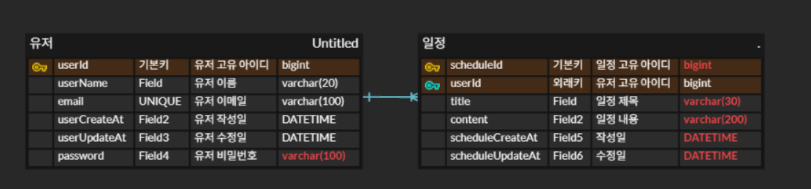


## PostMan 실행 결과
- 회원 가입
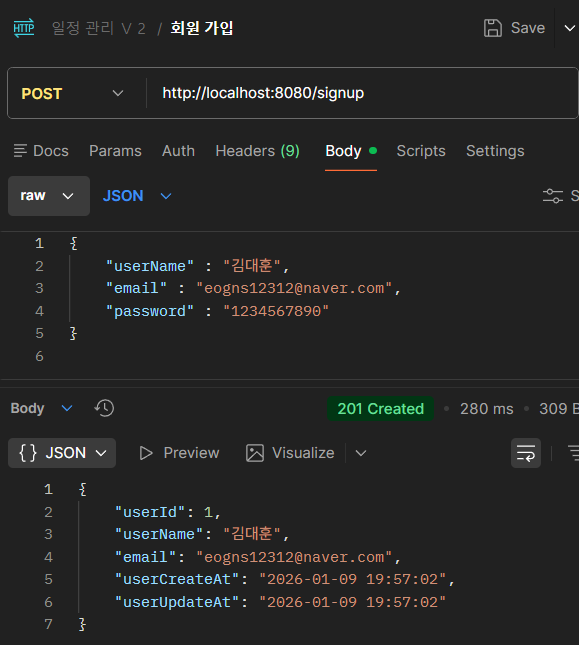
- 로그인
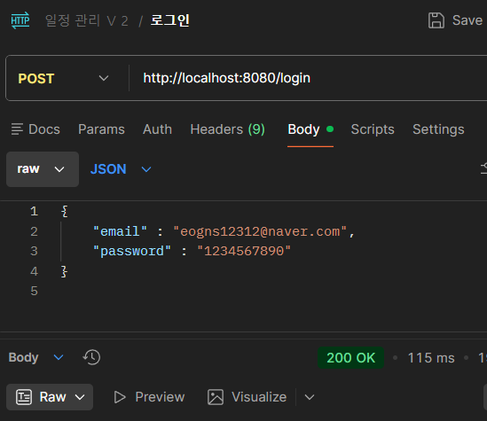
- 로그아웃
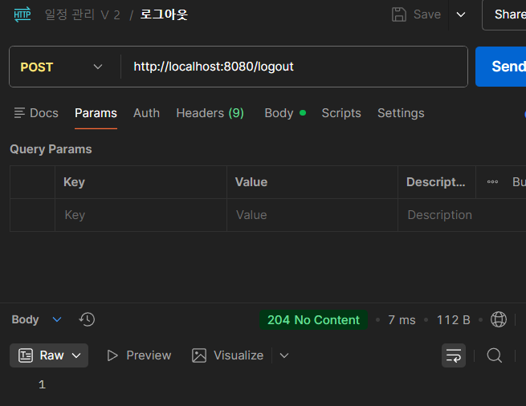
- 유저 전체 조회
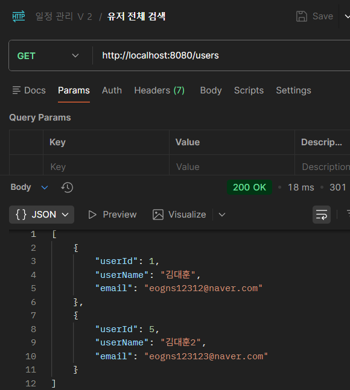
- 유저 단 건 조회

- 유저 수정
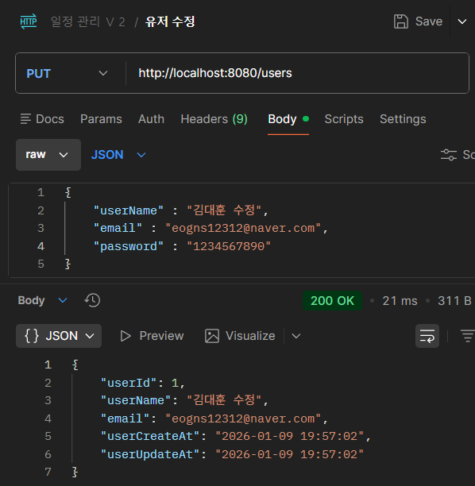
- 유저 삭제
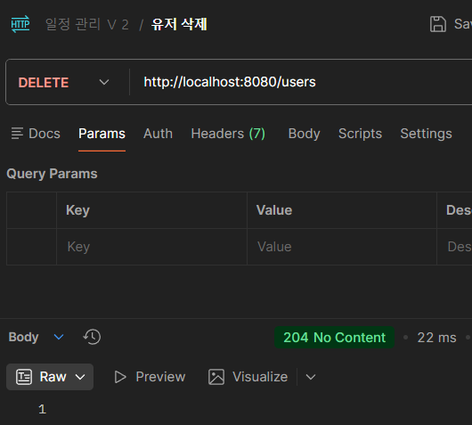
- 일정 생성
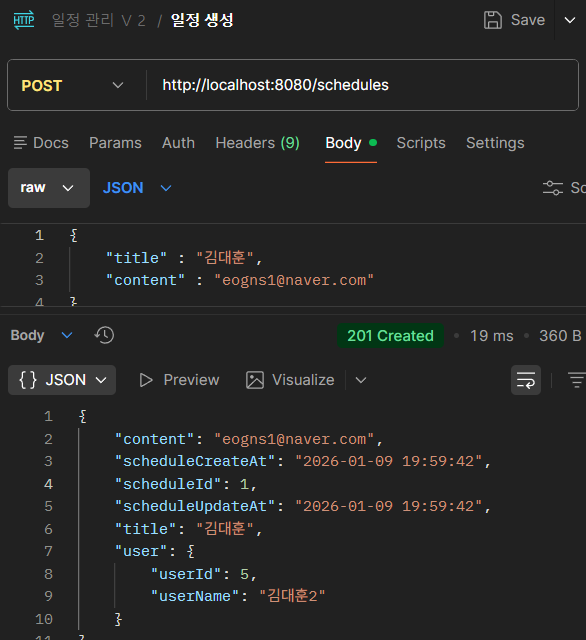
- 일정 전체 조회
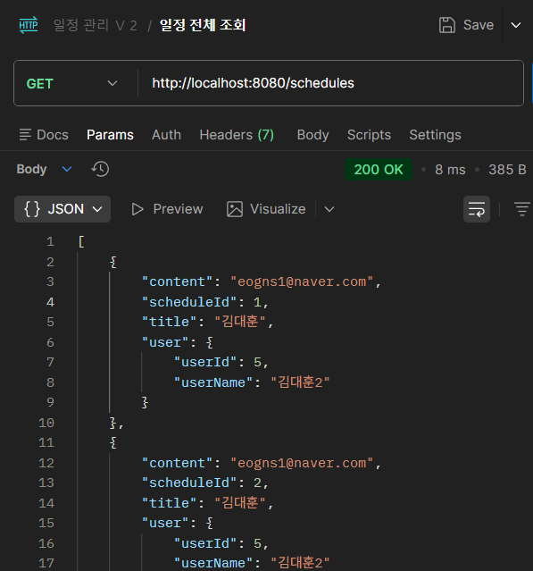
- 일정 전체 조회(페이징)

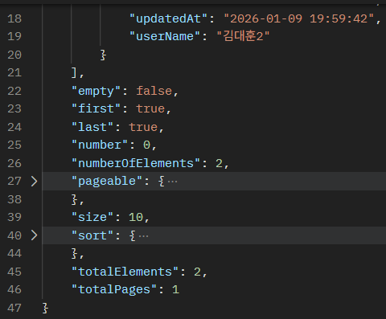
- 일정 단 건 조회
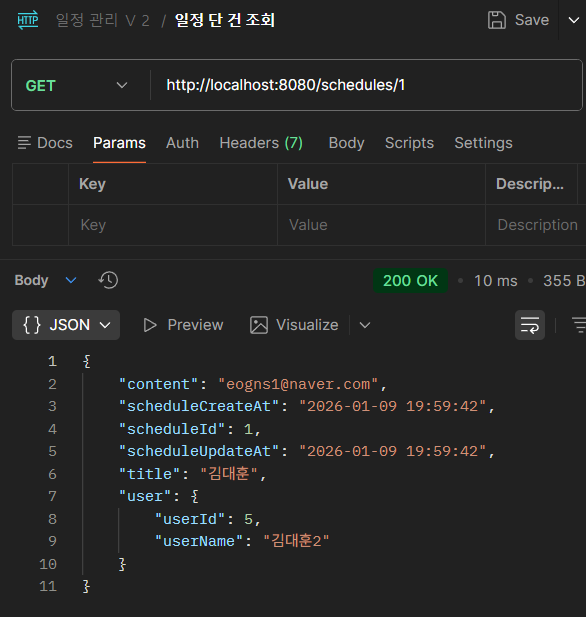
- 일정 수정
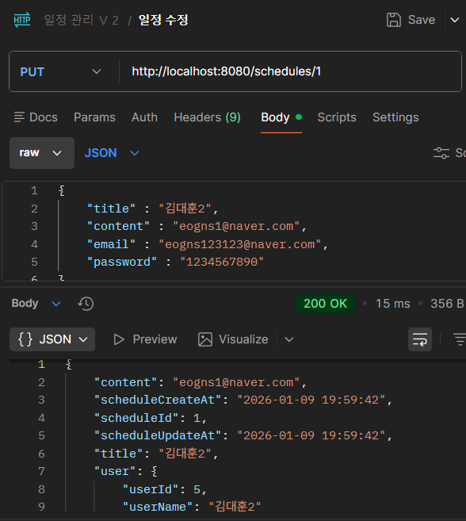
- 일정 삭제
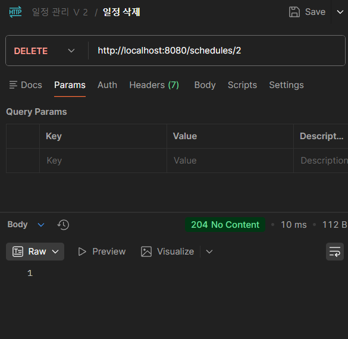
- 댓글 생성
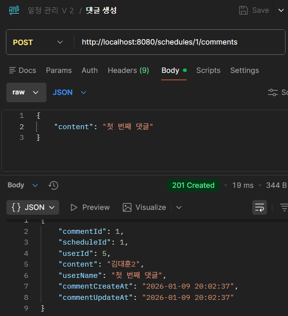
- 특정 일정 댓글 전체 조회

- 특정 일정 댓글 단건 조회
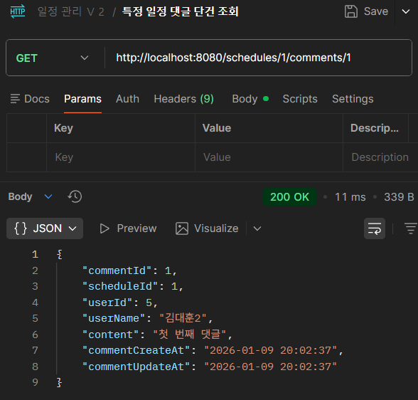
- 특정 일정 댓글 수정
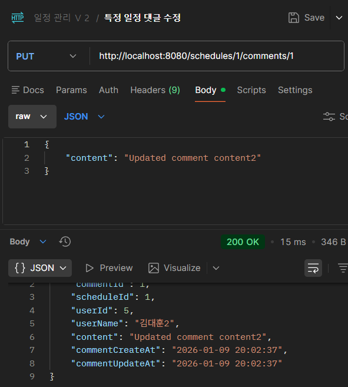
- 특정 일정 댓글 삭제
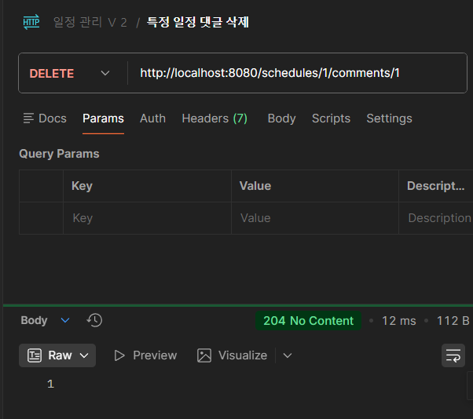
- 수정 시 password가 틀렸을 경우
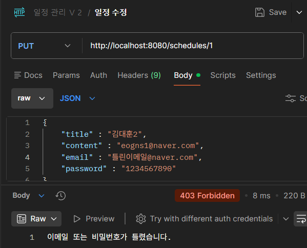


  