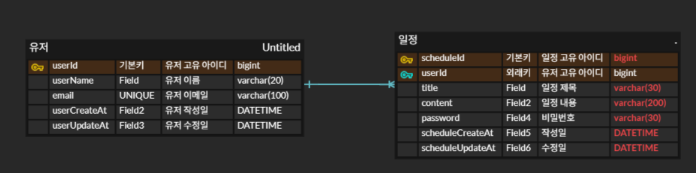

# 일정 관리 앱 만들기 Vol_2
- 작성자 : 김대훈
- 시작 일 : 2026년 1월 07일

## 파일 구조와 진행 방식
각 Lv의 작은 파트(기능)마다 commit 하였고, 커밋 메시지를 통해 해당 기능에 대한 설명 하였습니다. <br>
그리고, 설명이 부가적으로 필요한 기능 같은 경우에는 해당 기능 코드에 주석으로 부가 설명을 덫붙였습니다.

또한 branch는 각 스텝 별로 Lv_1, Lv_2, Lv_3, Lv_4, Lv_5, ...로 각각 나누어서 진행하였습니다.

## API 명세서
## `일정 생성`

**Request**
- **Method:** POST
- **API 엔드포인트:** POST /schedules
- **Body:**  `title` ,`content`, `name`, `password` 필수 입력
- **고유 식별자**  작성 유저명(user 테이블에서 가져옴)
    ```json lines
    {
    	"title" : "2026년 신정",
    	"content" : "2026년 1월 1일이다.",
    	"name" : "김대훈",
    	"password" : "1234"
    }
    ```
- createDate, updateDate는 서버 자동 생성

**Response**
- **Status Code: `201 Created`** 생성 성공
    - **Body**

      **설명:** 서버에서 `scheduleId`가 부여된 완전한 `schedule` 객체를 반환.(password 제외)

    ```json lines
    {
        "scheduleId": 1,
	    "title" : "2026년 신정",
	    "content" : "2026년 1월 1일이다.",
	    "name" : "김대훈",
	    "createDate" : "2025-12-29 15:13:21",
        "updateDate" : "2025-12-29 15:13:21"
    }
    ```

- **Status Code: `400 Bad Request`** 요청 오류
    - **Body:**

      **설명:**   필수 필드가 누락된 경우 발생.

    ```json
    {
      "message": "일정 제목, 일정 내용, 작성자명, 비밀번호는 필수 입력입니다."
    }
    ```

## `전체 일정 조회`

**Request**
- **Method:** GET
- **API 엔드포인트:** GET /schedules

**Response**
- **Status Code: `200 OK`** 조회 성공
    - **Body**

      **설명:** `schedule` 객체를 반환. 없으면 빈 배열`[]` 반환.(password 제외)

    ```json lines
    [
      {
           "scheduleId": 1,
           "title" : "2026년 신정",
	       "content" : "2026년 1월 1일이다.",
	       "name" : "김대훈",
	       "createDate" : "2025-12-29 15:13:21",
           "updateDate" : "2025-12-29 15:13:21"
       },
       {
           "scheduleId": 2,
           "title" : "2026년 크리스마스",
	       "content" : "2026년 12월 25일이다.",
	       "name" : "김대훈",
	       "createDate" : "2025-12-29 15:13:21",
           "updateDate" : "2025-12-29 15:13:21"
       }
    ]
    ```

- **Status Code: `500 Internal Server Error`** 서버 내부 오류
    - **Body:**

      **설명:**   서버 오류

    ```json
    {
      "message": "요청을 처리하는 중 서버에서 오류가 발생했습니다."
    }
    ```

## `선택 일정 조회`

**Request**
- **Method:** GET
- **API 엔드포인트:** GET /schedules/{scheduleId}
- **Path Parameters:** key: scheduleId, Type: Long, 필수 -> 일정의 각 고유 ID로 조회

**Response**
- **Status Code: `200 OK`** 조회 성공
    - **Body**

      **설명:** 해당하는 scheduleId의 `schedule` 객체를 반환.(password 제외)

    ```json lines
      {
           "scheduleId": 1,
           "title" : "2026년 신정",
	       "content" : "2026년 1월 1일이다.",
	       "name" : "김대훈",
	       "createDate" : "2025-12-29 15:13:21",
           "updateDate" : "2025-12-29 15:13:21"
       }
    ```

- **Status Code: `404 Not Found`** 리소스 없음
    - **Body:**

      **설명:**   파라미터로 받은 scheduleId가 존재하지 않을 경우

    ```json
    {
      "message": "해당 일정을 찾을 수 없습니다."
    }
    ```

- **Status Code: `500 Internal Server Error`** 서버 내부 오류
    - **Body:**

      **설명:**   서버 오류, 파라미터로 받은 scheduleId가 존재하지 않을 경우

    ```json
    {
      "message": "요청을 처리하는 중 서버에서 오류가 발생했습니다."
    }
    ```


## `일정 수정`

**Request**
- **Method:** PUT
- **API 엔드포인트:** PUT /schedules/{scheduleId}
- **Path Parameters:** key: scheduleId, Type: Long, 필수
- **Body:**  `title` , `name`입력 `password` 필수 입력

    ```json lines
    {
    	"title" : "2026년 신정 다음 날",
    	"name" : "김대훈2",
    	"password" : "1234"
    }
    ```


**Response**
- **Status Code: `200 OK`** 수정 성공
    - **Body**
      **설명:** 해당하는 `scheduleId`의 수정된 객체 반환(수정일 현 시간으로 변경)
    ```json lines
      {
           "scheduleId": 1,
           "title" : "2026년 신정 다음 날",
	       "content" : "2026년 1월 1일이다.",
	       "name" : "김대훈2",
	       "createDate" : "2025-12-29 15:13:21",
           "updateDate" : "2025-12-30 00:00:00"
       }
    ```

- **Status Code: `401 Unauthorized`** 비밀 번호 오류
    - **Body:**

      **설명:**   비밀 번호가 틀렸을 경우

    ```json
    {
      "message": "비밀번호가 맞지 않거나 해당 일정을 찾을 수 없습니다."
    }
    ```

- **Status Code: `404 Not Found`** 리소스 없음
    - **Body:**

      **설명:**   파라미터로 받은 scheduleId가 존재하지 않을 경우

    ```json
    {
      "message": "해당 일정을 찾을 수 없습니다."
    }
    ```


- **Status Code: `500 Internal Server Error`** 서버 내부 오류
    - **Body:**

      **설명:**   서버 오류, 파라미터로 받은 scheduleId가 존재하지 않을 경우

    ```json
    {
      "message": "요청을 처리하는 중 서버에서 오류가 발생했습니다."
    }
    ```

## `일정 삭제`

**Request**
- **Method:** DELETE
- **API 엔드포인트:** DELETE /schedules/{scheduleId}
- **Path Parameters:** key: scheduleId, Type: Long, 필수
- **Body:** `password` 필수 입력
    ```json lines
    {
    	"password" : "1234"
    }
    ```
**Response**
- **Status Code: `204 No Contents`** 삭제 성공

  **설명:** 해당하는 scheduleId의 일정 삭제


- **Status Code: `401 Unauthorized`** 비밀 번호 오류
    - **Body:**

      **설명:**   비밀번호가 틀렸을 경우

    ```json
    {
      "message": "비밀번호가 맞지 않거나 해당 일정을 찾을 수 없습니다."
    }
    ```


- **Status Code: `404 Not Found`** 리소스 없음
    - **Body:**

      **설명:**   파라미터로 받은 scheduleId가 존재하지 않을 경우

    ```json
    {
      "message": "해당 일정을 찾을 수 없습니다."
    }
    ```


- **Status Code: `500 Internal Server Error`** 서버 내부 오류
    - **Body:**

      **설명:**   서버 오류, 파라미터로 받은 scheduleId가 존재하지 않을 경우

    ```json
    {
      "message": "요청을 처리하는 중 서버에서 오류가 발생했습니다."
    }
    ```

## `유저 생성`

**Request**
- **Method:** POST
- **API 엔드포인트:** POST /users
- **Body:**  `userName`, `email`, `password` 필수 입력
- **고유 식별자** 

    ```json lines
    {
    	"userName" : "김대훈",
    	"email" : "eogns1@naver.com",
    	"password" : "1234"
    }
    ```
- createDate, updateDate는 서버 자동 생성

**Response**
- **Status Code: `201 Created`** 생성 성공
    - **Body**

      **설명:** 서버에서 `scheduleId`가 부여된 완전한 `schedule` 객체를 반환.(password 제외)

    ```json lines
    {
        "scheduleId": 1,
	    "title" : "2026년 신정",
	    "content" : "2026년 1월 1일이다.",
	    "name" : "김대훈",
	    "createDate" : "2025-12-29 15:13:21",
        "updateDate" : "2025-12-29 15:13:21"
    }
    ```

- **Status Code: `400 Bad Request`** 요청 오류
    - **Body:**

      **설명:**   필수 필드가 누락된 경우 발생.

    ```json
    {
      "message": "일정 제목, 일정 내용, 작성자명, 비밀번호는 필수 입력입니다."
    }
    ```


## ERD

## PostMan 실행 결과
- 일정 생성
  
- 일정 전체 조회
  
- 일정 단 건 조회
  

- 일정 수정
  

- 일정 삭제
  

- 댓글 생성
  

- 일정 조회 업그레이드
  


  